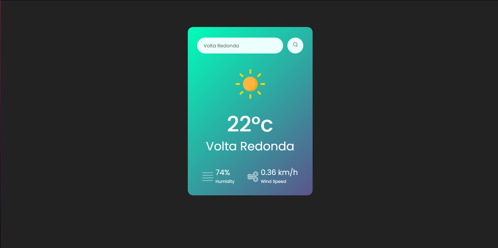

# Weather App ☀️🌧️

Este é um aplicativo simples que permite aos usuários verificar o clima atual de qualquer cidade. Ele usa a API do [OpenWeatherMap](https://openweathermap.org/) para obter dados meteorológicos precisos.

## 🎯 Funcionalidades

- Pesquisa de clima em tempo real com base na cidade digitada.
- Exibe informações como temperatura, descrição do clima, umidade e velocidade do vento.
- Interface simples e intuitiva.

## 🔧 Tecnologias Utilizadas

- **HTML5**
- **CSS3**
- **JavaScript (ES6)**
- **API do OpenWeatherMap**

## 🖼️ Screenshots

## Autor
Desenvolvido por @Vinnyszz

Linkedin: https://www.linkedin.com/in/viniciusprudente/
